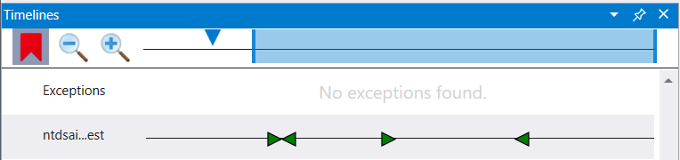
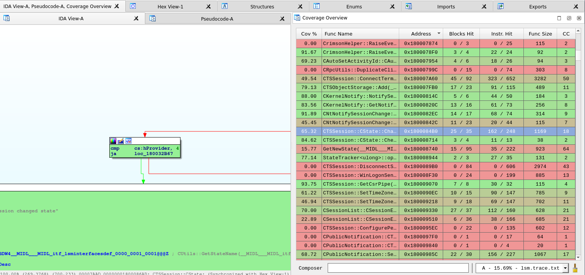
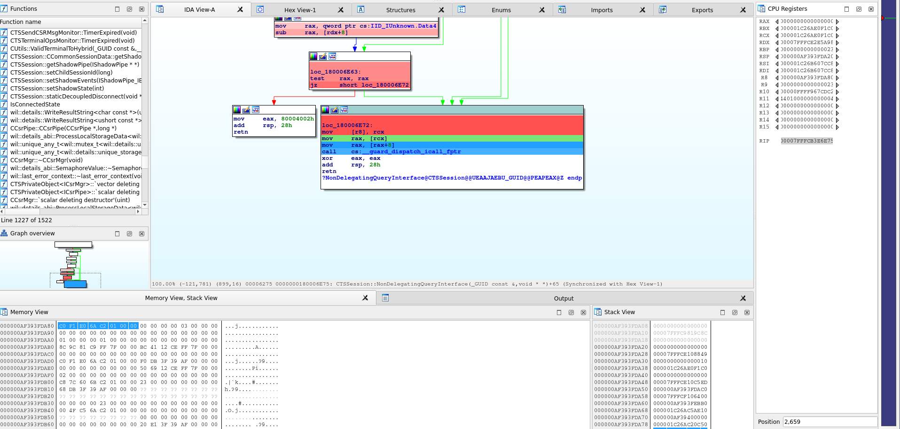

# TTD-Bindings

Bindings (PoC) for [Microsoft WinDBG Time Travel Debugging (TTD)](https://docs.microsoft.com/en-us/windows-hardware/drivers/debugger/time-travel-debugging-overview).

*This is for educational purposes only. Please consult and comply with the related Microsoft licensing*

## Usage

* `TTD/` is the main wrapper. `TTDReplay.dll` and `TTDReplayCPU.dll` (from WinDBG Preview, at least v1.2111) must be present in the same directory than the executable
* `example_api/` highlights some of the wrapping
* `example_diff/` shows how to use the wrapping to perform naive trace diffing
* `example_calltree/` produces a call tree of a trace excerpt
* `example_cov/` produces a [Lighthouse](https://github.com/gaasedelen/lighthouse) compatible coverage of modules in a trace excerpt 
* `example_tenet/` produces a [Tenet](https://github.com/gaasedelen/tenet) compatible trace from a TTD trace
* `python-bindings/` provides Python bindings over TTD

After performing one or several traces using Windbg Preview, one can open the `.run` file:
```C++
// Openning the trace
TTD::ReplayEngine ttdengine = TTD::ReplayEngine();
ttdengine.Initialize(L"D:\\traces\\demo.run");

// Retrieve information, such as the starting position
TTD::Position* first = ttdengine.GetFirstPosition();
printf("%llx:%llx\n", first->Major, first->Minor);

// Get a Cursor instance
TTD::Cursor ttdcursor = ttdengine.NewCursor();

// Set it to the first position
ttdcursor.SetPosition(first);

// Print the value of RCX
TTD::TTD_Replay_RegisterContext* ctxt = ttdcursor.GetCrossPlatformContext();
printf("RCX: %llx\n", ctxt->rcx);

// Make 3 step forward
TTD::TTD_Replay_ICursorView_ReplayResult replayresult;
TTD::Position* last = ttdengine.GetLastPosition();
ttdcursor.ReplayForward(&replayresult, last, 3);
```

Currently, the wrapping system supports:

* Openning a trace file
* Getting and setting the position
* Getting:
    * Peb address
    * Thread count
    * Module list
    * Program counter
    * Registers
* Query memory
* Replaying forward and backward
* Adding a callback for "CallRet"
* Memory breakpoints (R/W/X)
* During a callback, getting:
    * Returned value
    * Current position
    * Current PC

## Exemple: diffing path in a trace

Objective: find which instruction actually check for `PrimaryGroupID` possibilities when setting one in an Active Directory. For more information, please read [this article].(https://github.com/commial/experiments/tree/master/windows/random_things/primaryGroupID)

First, a trace is made on the Domain controller's `lsass.exe` while attempting to:

1. Set an un-authorized `PrimaryGroupID` to the user `simple`
1. Set an authorized `PrimaryGroupID` on the user `simple`

Then, the trace is loaded in Windbg Preview for analysis. We first find one of the entrypoint, for instance by looking at the callstack during some of the calls.
As a result, we saw that `ntdsai!LDAP_CONN::ModifyRequest` seems to be called when a LDAP request is made. This method is called twice, as expected:



The first time, it quickly fails; the second, it processes the request, taking more time.

Now, here is the strategy:

1. Start from the first and the second call to `ntdsai!LDAP_CONN::ModifyRequest`
1. Step some instruction for both, and observe the program counter

* If it differ, get back to the last known sync point, and step less instruction
* If it is the same, continue from the new position

Using this method, we quickly end in `ntdll!RtlpAllocateHeap`. Indeed, while browsing the heap chunks, they might be some differences (as new chunk have been allocated between the two calls).

We know this is a false positive. To avoid it, we can:

1. Register a `CallReturnCallback` to track function calls and their return address
1. On detected diff, check if a function in the current call stack is in the allow-list and its corresponding return address is the same for both traces
1. If it is, forward both traces to the return address, and consider it a new sync point 

A stack of calls and return addresses is used, to handle cases such as:
```C
f(
    subcall()
    diff_call(
        // Difference is here, we want to go out of `f`
    )
)
```

This implementation is available in `example_diff`.
In addition to allocation function, a few others functions are allow-listed, such as column reading APIs.

As a result, the actual diff is quickly found:

```
Openning the trace
Openning the trace2
STEP 10000
Trace 1: 177b:3f        | Trace 2: 6871:3f
Trace 1 ends on 7ffb0b9cdca0    | Trace 2 ends on 7ffb0b9f2e2b
Rollback...OK
STEP 5000
Trace 1: 177b:3f        | Trace 2: 6871:3f
Trace 1 ends on 7ffb10ec1b5c    | Trace 2 ends on 7ffb10ec1c4d
Rollback...OK
STEP 2500
Trace 1: 177b:3f        | Trace 2: 6871:3f
Trace 1 ends on 7ffb10ec1d9b    | Trace 2 ends on 7ffb10ec1d9b
STEP 2500
Trace 1: 1788:21a       | Trace 2: 687e:21a
Trace 1 ends on 7ffb10ec1b5c    | Trace 2 ends on 7ffb10ec1c4d
Rollback...OK
STEP 1250
Trace 1: 1788:21a       | Trace 2: 687e:21a
Trace 1 ends on 7ffb10ebfc88    | Trace 2 ends on 7ffb10ec1b06
Rollback...OK
STEP 625
Trace 1: 1788:21a       | Trace 2: 687e:21a
Trace 1 ends on 7ffb0ba1f327    | Trace 2 ends on 7ffb0ba1eef4
Rollback...OK
STEP 312
Trace 1: 1788:21a       | Trace 2: 687e:21a
Trace 1 ends on 7ffb10f568d0    | Trace 2 ends on 7ffb10ec3ed3
Rollback...OK

...

STEP 2
Trace 1: 1788:229       | Trace 2: 687e:229
Trace 1 ends on 7ffb10ec1de8    | Trace 2 ends on 7ffb10ec1ec9
Rollback...OK
STEP 1
Trace 1: 1788:229       | Trace 2: 687e:229
Trace 1 ends on 7ffb10ec1de5    | Trace 2 ends on 7ffb10ec1ec1
Rollback...OK
Last known sync reference: Trace 1: 1788:229    | Trace 2: 687e:229
Cur func: 7ffb10ec1af0 -> 7ffb10ebfcad | 7ffb10ec1af0 -> 7ffb10ebfcad
Common func/ret:
7ffb0ba1efa0 -> 7ffb0b9aa1bc
        7ffb0bc0c8bc -> 7ffb0ba1f245
                7ffb0b9b7a9c -> 7ffb0bc0c8ec
                        7ffb0b9d37a0 -> 7ffb0b9b7ad7
                                7ffb10ebf2a0 -> 7ffb0b9d38bc
-> Resync traces after their RET on 7ffb0b9d38bc...TRACE1 7ffb0b9d38bc......TRACE2 7ffb0b9d38bc
STEP 10000

...

Rollback...OK
Last known sync reference: Trace 1: 1ad2:43     | Trace 2: 6b7e:43
Cur func: 7ffb0ca01f10 -> 7ffb0bac294d | 7ffb0ca01f10 -> 7ffb0bac294d
Common func/ret:
7ffb0b9f2848 -> 7ffb0b9aa396
        7ffb0b9f33b0 -> 7ffb0b9f29c6
                7ffb0b9f35ac -> 7ffb0b9f34eb
                        7ffb0b9909f4 -> 7ffb0b9f389e
                                7ffb0b991bc8 -> 7ffb0b990af0
                                        7ffb0b993334 -> 7ffb0b991f3e
                                                7ffb0ca01f10 -> 7ffb0bac294d
```

Going to `1ad2:43` and `6b7e:43`, we indeed ends on the expected check in `samsrv!SampAssignPrimaryGroup` \o/!

```
||0:0:001> !ttdext.tt 1ad2:43
Setting position: 1AD2:43
Time Travel Position: 1AD2:43
samsrv!SampAssignPrimaryGroup+0xb4:
00007ffb`0ca01fc4 7409            je      samsrv!SampAssignPrimaryGroup+0xbf (00007ffb`0ca01fcf) [br=0]
||0:0:001> k
 # Child-SP          RetAddr               Call Site
00 000000f0`006fd8b0 00007ffb`0bac294d     samsrv!SampAssignPrimaryGroup+0xb4
01 000000f0`006fd970 00007ffb`0b991f3e     ntdsai!SampDsSetInformationUser+0x12f619
02 000000f0`006fdb80 00007ffb`0b990af0     ntdsai!SampWriteSamAttributes+0x376
03 000000f0`006fdc90 00007ffb`0b9f389e     ntdsai!SampModifyLoopback+0xfc
04 000000f0`006fdd00 00007ffb`0b9f34eb     ntdsai!SampModifyLoopbackCheck+0x2f2
05 000000f0`006fddd0 00007ffb`0b9f29c6     ntdsai!LocalModify+0x13b
06 000000f0`006fe0f0 00007ffb`0b9aa396     ntdsai!DirModifyEntryNative+0x17e
07 000000f0`006fe450 00007ffb`0bd22ee9     ntdsai!LDAP_CONN::ModifyRequest+0x386
08 000000f0`006feac0 00007ffb`0b9c297a     ntdsai!LDAP_CONN::ModifyRequest+0x41
09 000000f0`006feb20 00007ffb`0ba1c6a2     ntdsai!LDAP_CONN::ProcessRequestEx+0xb6e
0a 000000f0`006fedf0 00007ffb`0ba1c069     ntdsai!LDAP_CONN::IoCompletion+0x51a
0b 000000f0`006ff650 00007ffb`0b912dd6     ntdsai!LdapCompletionRoutine+0x139
0c 000000f0`006ff6f0 00007ffb`0b912ae4     NTDSATQ!AtqpProcessContext+0xd6
0d 000000f0`006ff740 00007ffb`0fff7974     NTDSATQ!AtqPoolThread+0x1a4
0e 000000f0`006ff7d0 00007ffb`10f0a2f1     KERNEL32!BaseThreadInitThunk+0x14
0f 000000f0`006ff800 00000000`00000000     ntdll!RtlUserThreadStart+0x21
```

## Exemple: call tree

In order to get a quick idea of what functions are called in a trace, one can write a tool which:

* register a `CallRetCallback`:
    * tracking the call stack depth
    * printing the callee function
    * printing the returned address 
* run through a part of the trace

To make a more usable trace, one can also:

* print the position in the trace, to ease further investigation
* print the returned value
* use symbols (relative to the trace's modules, ie. even if not present on the system) to resolve addresses

`example_calltree` implements theses features.
Here is an example on the same `lsass` trace:

```bash
# Run the tool
example_calltree.exe -b 177B:3E -e 1B76:31 D:\traces\lsass01.run > out.txt
# ~1.5 second, for ~25K entries

# Whole trace would have needed ~7.5 seconds for ~140K entries
```

Outputs:

```
Openning the trace
ModuleList:
256064a0000     3000    C:\Windows\system32\msprivs.DLL
7ff7f5710000    11000   C:\Windows\system32\lsass.exe
7ffae3170000    171000  C:\ProgramData\Microsoft\Windbg\0-0-0\TTD\TTDRecordCPU.dll
7ffaf3ea0000    22000   C:\Windows\SYSTEM32\certpoleng.dll
7ffaf3fe0000    1a000   C:\Windows\system32\keyiso.dll

...

-> ntdsai!LDAP_CONN::ModifyRequest (7ffb0b9aa010) [177b:3e]
| -> ntdsai!memset (7ffb0baad676) [177b:5e]
| <- ntdsai!+2a0bb (7ffb0b9aa0bb) [177b:a0] RETURN f0006fe550
| -> ntdsai!memset (7ffb0baad676) [177b:a4]
| <- ntdsai!+2a0d0 (7ffb0b9aa0d0) [177b:118] RETURN f0006fe6b0
| -> ntdsai!THREAD_STOPWATCH::Start (7ffb0b9ad920) [177b:126]
| | -> ntdsai!THGetThreadCpuTime (7ffb0ba1c13c) [177b:12a]
| | | -> KERNEL32!GetCurrentThread (7ffb0fff57f0) [177b:12c]
| | | <- ntdsai!+9c146 (7ffb0ba1c146) [177b:12e] RETURN fffffffffffffffe
| | | -> KERNEL32!GetThreadTimesStub (7ffb0fff9a80) [177b:135]
| | | | -> ntdll!NtQueryInformationThread (7ffb10f4fe80) [177b:147]
| | | | <- KERNELBASE!+69a76 (7ffb0d609a76) [177d:0] RETURN 0
| | | | -> KERNELBASE!_security_check_cookie (7ffb0d628890) [177d:f]
| | | | <- KERNELBASE!+69ab5 (7ffb0d609ab5) [177d:15] RETURN 1
| | | <- ntdsai!+9c168 (7ffb0ba1c168) [177d:1b] RETURN 1
| | <- ntdsai!+2d92e (7ffb0b9ad92e) [177d:21] RETURN 2625a0
| | -> KERNELBASE!GetTickCount (7ffb0d5f8fd0) [177d:23]
| | <- ntdsai!+2d938 (7ffb0b9ad938) [177d:29] RETURN daa1b
| <- ntdsai!+2a11b (7ffb0b9aa11b) [177d:2e] RETURN daa1b
| -> ntdsai!LDAP_CONN::IsBound (7ffb0b9aa7f0) [177d:32]
| <- ntdsai!+2a12b (7ffb0b9aa12b) [177d:3b] RETURN 1
| -> ntdsai!memset (7ffb0baad676) [177d:44]
| <- ntdsai!+2a15b (7ffb0b9aa15b) [177d:b8] RETURN f0006fe6b0
| -> ntdsai!InitCommarg (7ffb0b9f6fc0) [177d:bb]
| | -> ntdsai!memset (7ffb0baad676) [177d:c1]
| | <- ntdsai!+76fd6 (7ffb0b9f6fd6) [177d:f3] RETURN f0006fe6b0
| <- ntdsai!+2a170 (7ffb0b9aa170) [177d:102] RETURN 400a
| -> ntdsai!LDAP_LogAPIEntry (7ffb0ba1d6d4) [177e:3]
| | -> KERNEL32!TlsGetValueStub (7ffb0fff5250) [177e:11]
| | <- ntdsai!+9d714 (7ffb0ba1d714) [177e:19] RETURN 25606fb0cf0
| | -> ntdsai!SetActiveThreadStateInfoStringA (7ffb0ba1eb8c) [177e:1c]
| | | -> ntdsai!DsaSafeMult (7ffb0ba1eb30) [177e:33]
| | | <- ntdsai!+9ebe0 (7ffb0ba1ebe0) [177e:4b] RETURN c8

...
```

## Example: coverage

To understand what a code is actually doing, one can extract the instruction coverage of a trace.
To do so, `example_cov` is a tool which:

* list available modules for filtering
* for each target, add a breakpoint on execution, from the module's base address to its end
* register a `MemoryWatchpointCallback`:
  * track in a set each breakpoint's address hitted
* run through a part of the trace
* export the resultings addresses in `module_name.trace.txt` files

Here is an example with a trace of the *Local Session Manager* (`lsm.dll`):

```bash
# Run the tool
example_cov.exe -m lsm D:\traces\lsm.run
# After a few seconds:
Openning the trace
Tracking lsm
Number of entry: 0x1000, current position 13b6:26
Number of entry: 0x1000, current position c03:9
Number of entry: 0x2000, current position 134f:5b
Number of entry: 0x3000, current position 1991:205
Number of entry: 0x3000, current position 720c:1d
Number of entry: 0x3000, current position 36af:28
Number of entry: 0x3000, current position 7b01:10
Number of entry: 0x4000, current position 100d2:396
Number of entry: 0x4000, current position a7fd:18
Number of entry: 0x4000, current position ff7f:17c
Got 0x42f9 addresses
Dump to file lsm.trace.txt
```

The `lsm.trace.txt` file looks like:

```bash
lsm+1eb0
lsm+1eb7
lsm+1eba
lsm+1ebe
...
```

As this format is compatible with [Lighthouse](https://github.com/gaasedelen/lighthouse), one can visualize it in IDA:



By doing several traces, or one trace with several call splitted using `-b` (*begin*) and `-e` (*end*) arguments, one can obtain overlapping coverage map.
Diffing them could be a great way to identify specific code snippets.

## Example: Trace exploration in IDA

[Tenet](https://github.com/gaasedelen/tenet) is a "Trace Explorer" plug-in for IDA.
Please refer to the official website for the full feature description.

The `example_tenet` example produces a Tenet compatible trace for a given module, from a TTD trace.

For instance:
```bash
# Run the tool, for the module `lsm.dll`
example_tenet.exe -m lsm D:\traces\lsm.run
# The output is in `lsm.trace.tenet`
Openning the trace
Track c:\windows\system32\lsm.dll [7fffcb3e0000 to 7fffcb491fff]
Dump to file lsm.trace.tenet
0x1000 instructions...
0x2000 instructions...
0x3000 instructions...
0x4000 instructions...
0x5000 instructions...
0x6000 instructions...
0x7000 instructions...
```

As a side note, if the TTD trace is going to other modules (such as `memcpy` implementation), the difference from the `call` instruction and the next one will provide a summary of all memory accesses done by `memcpy`.

The resulting `lsm.trace.tenet` can then be loaded in IDA:



## Python

### Setup

Either:

* use the latest `pyTTD.pyd` [release](https://github.com/commial/ttd-bindings/releases/latest)
* or compile the `python-bindings` project.

### Usage

With `pyTTD.pyd`, `TTDReplay.dll` and `TTDReplayCPU.dll` in the directory, one can import `pyTTD`:

```python
import pyTTD

# Open the trace
eng = pyTTD.ReplayEngine()
eng.initialize("D:\\traces\\trace.run")

# Get positions
first = eng.get_first_position()
last = eng.get_last_position()
print(f"Trace from {first} to {last}")

# Get a cursor
cursor = eng.new_cursor()
cursor.set_position(first)

# Retrieve PC
print(f"PC: {cursor.get_program_counter():x}")

# Print RCX
ctxt = cursor.get_context_x86_64()
print("RCX: %x" % ctxt.rcx)

# Read the memory at RCX on 16 bytes
print("@128[RCX]: %s" % cursor.read_mem(ctxt.rcx, 16))
```

More API example are available in `example_api/example_api.py`.

## References

* [MSDN - Time Travel Debugging - Overview](https://docs.microsoft.com/en-us/windows-hardware/drivers/debugger/time-travel-debugging-overview)
* [TTD analysis](https://www.synacktiv.com/ressources/rumpinrennes-ttd.pdf)  by @w4kfu at Rump'in Rennes 2019
* [Initial iDNA paper](https://www.usenix.org/legacy/events/vee06/full_papers/p154-bhansali.pdf) : S. Bhansali, W.-K. Chen, S. de Jong, A. Edwards, R. Murray, M. Drinic, D. Mihocka, and J. Chau. Framework for "Instruction-level tracing and analysis of program executions" in VEE, 2006.
